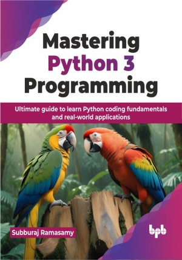

# Mastering Python 3 Programming

Learn the nitty-gritty of Python 3 programming language by coding and executing programs seamlessly in a lucid manner

This is the repository for [Mastering Python 3 Programming
](https://bpbonline.com/products/mastering-python-3-programming?variant=43676913172680),published by BPB Publications.

## About the Book
Python 3's clear and concise syntax and extensive collection of built-in libraries and frameworks make it a powerful and versatile programming language. This comprehensive guide, "Mastering Python 3 Programming", is designed to take you from the ground up to proficiency, equipping you to create effective Python programs.

This book provides an extensive overview of Python programming, covering a diverse range of topics essential for understanding Python 3. Each chapter explores key concepts like Unicode strings, functions and recursions, lists, tuples, sets, and dictionaries, along with advanced topics such as object-oriented programming, file handling, exception handling, and more. With detailed explanations and real-life examples, you will be able to build a strong understanding of Python 3. Throughout the book, you will find useful concepts and Python libraries explained clearly, along with case studies, executable programs, exercises, and easy-to-follow style.

This book focuses on real-world Python applications, developing critical thinking and problem-solving skills. It prepares students for Python challenges, equipping them to contribute meaningfully in their fields. With a deep understanding of Python, students gain confidence to explore new opportunities and drive innovation.

## What You Will Learn
• Set up IDLE for Python programming and execute programs.

• Adapt algorithm based problem-solving techniques.

• Utilize Python libraries for data visualization.

• Grasp data structures and common algorithms.

• Master decorators, file handling, exception handling, inheritance, polymorphism, and recursion in Python.
